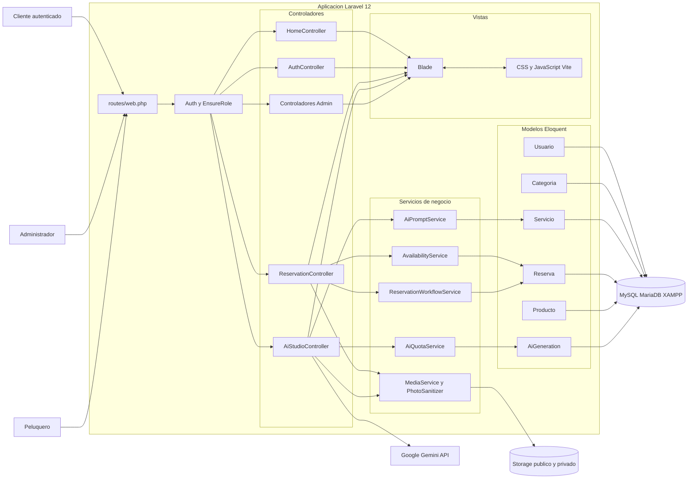
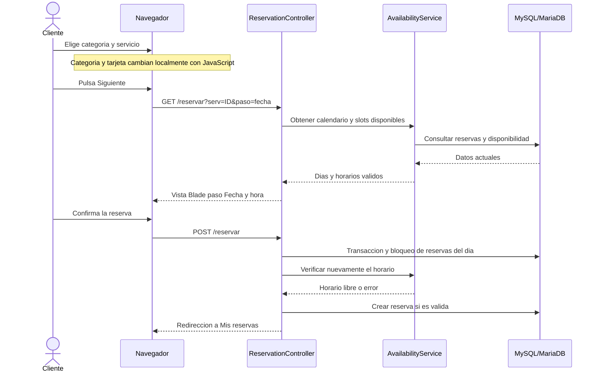
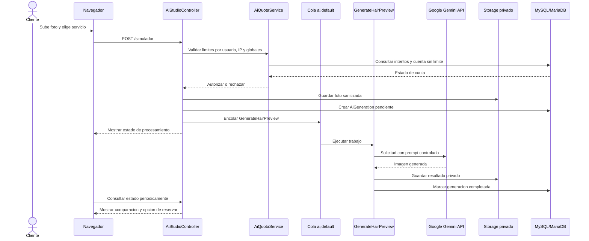
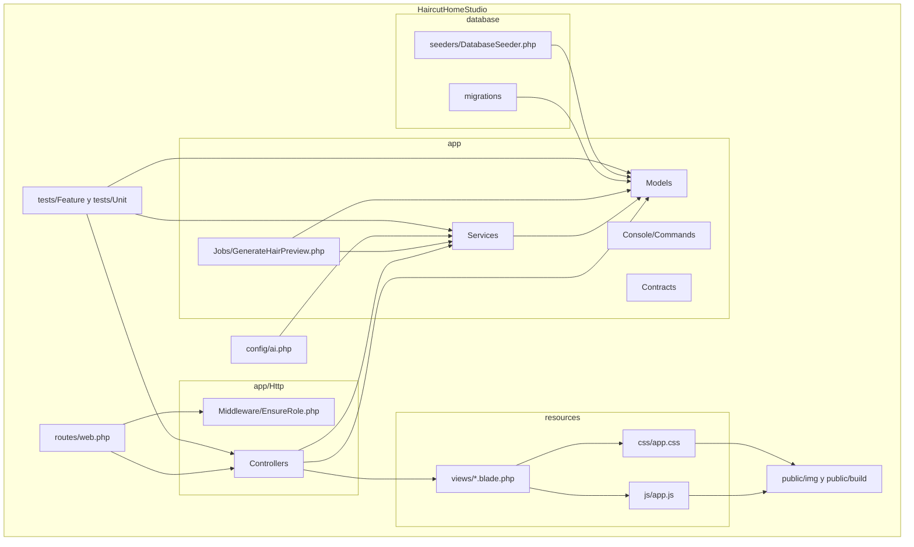
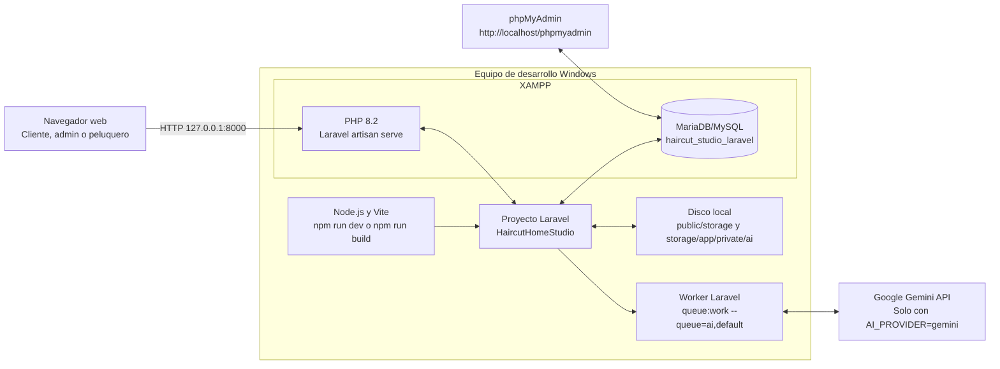
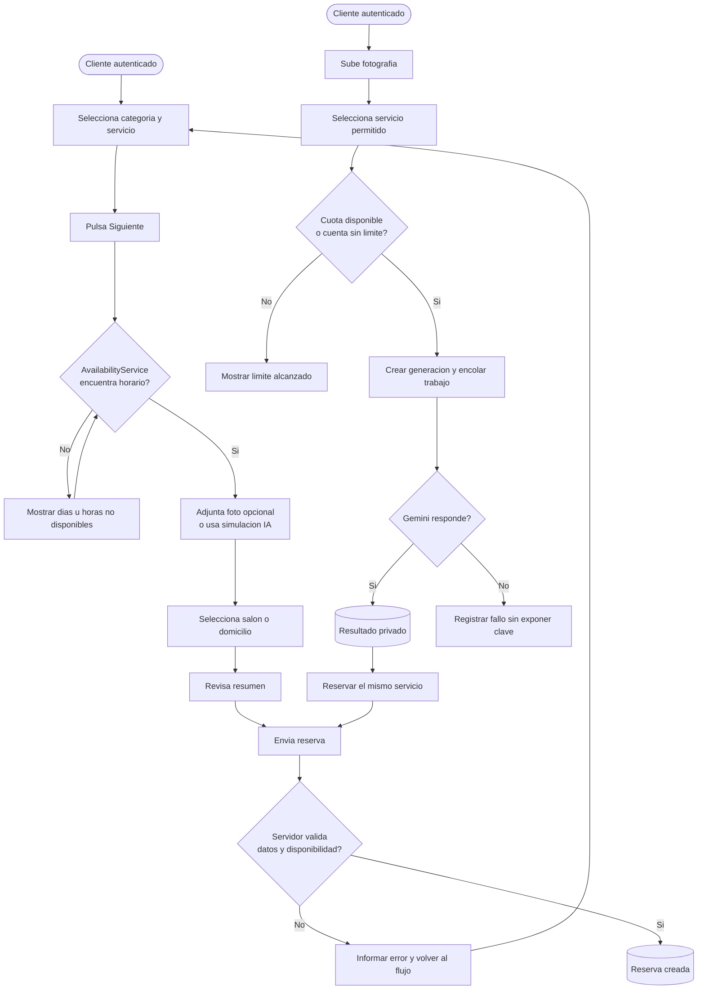

# Diagramas de Arquitectura 4+1 - Haircut Home Studio

## 1. Proposito y estilo arquitectonico

Haircut Home Studio es una aplicacion web desarrollada en Laravel 12 y PHP. Su arquitectura principal es **MVC (Modelo - Vista - Controlador)**, ampliada con servicios para la logica de negocio, trabajos en cola para procesos lentos y una capa de infraestructura para persistencia, archivos y servicios externos.

El patron MVC organiza la aplicacion de esta forma:

- **Modelo:** entidades Eloquent y migraciones que representan los datos de usuarios, servicios, reservas, productos y generaciones de IA.
- **Vista:** plantillas Blade, CSS y JavaScript que presentan la interfaz web y las interacciones del cliente.
- **Controlador:** recibe las solicitudes HTTP, aplica autorizacion y coordinacion, y entrega una vista o respuesta.

La capa de servicios concentra reglas que no deben quedar en las vistas ni en los controladores. Por ejemplo, `AvailabilityService` calcula horarios y solapamientos, mientras que `AiQuotaService` controla los limites de uso del simulador.

El modelo 4+1 describe la arquitectura desde cuatro perspectivas tecnicas y una perspectiva de escenarios. Los diagramas Mermaid incluidos se pueden visualizar en VS Code o copiar a https://mermaid.live. Para disenar una version grafica, se pueden reproducir en Draw.io, Lucidchart, Figma o Canva usando los mismos actores, contenedores y flechas.

---

## 2. Vista logica

La vista logica muestra las responsabilidades principales y sus relaciones. El nucleo de la aplicacion usa MVC; los controladores delegan las reglas de dominio en servicios y los modelos se comunican con MySQL mediante Eloquent.

### Elementos para redibujar

1. Dibuja tres actores: Cliente, Administrador y Peluquero.
2. Dibuja un contenedor grande llamado `Aplicacion Laravel 12`.
3. Dentro, separa Rutas/Middleware, Controladores, Servicios, Modelos y Vistas.
4. Fuera del contenedor coloca MySQL/MariaDB, almacenamiento de archivos y Google Gemini API.
5. Usa flechas desde actores hacia rutas, rutas hacia middleware/controladores, controladores hacia servicios/vistas y modelos hacia la base de datos.

---

## 3. Vista de procesos

La vista de procesos representa como se ejecutan los flujos importantes. La reserva se valida en el servidor; la generacion con IA puede pasar a una cola para no bloquear la solicitud web.

### Decisiones de proceso relevantes

- El cliente puede cambiar categoria y servicio sin recargar la pagina. La recarga controlada ocurre al avanzar a fecha para calcular disponibilidad real del servicio elegido.
- La reserva se comprueba dos veces: al mostrar horarios y antes de crearla. La segunda comprobacion evita dobles reservas ante solicitudes simultaneas.
- Gemini no recibe prompts escritos libremente por el cliente. El servidor crea instrucciones desde el servicio seleccionado.
- Los archivos de IA son privados. La foto de referencia de una reserva se guarda en el disco publico de Laravel bajo `storage/app/public/fotos`.
- `Admin Test Imagen` omite cuotas de IA por fines de prueba, pero conserva las protecciones contra procesos duplicados.

---

## 4. Vista de desarrollo

La vista de desarrollo organiza el codigo fuente por modulos y muestra las dependencias principales. Esta es la vista mas util para que el equipo sepa donde realizar cada cambio.

### Modulos principales

| Modulo | Responsabilidad | Archivos relevantes |
|---|---|---|
| Rutas y acceso | Define endpoints y roles autorizados | `routes/web.php`, `app/Http/Middleware/EnsureRole.php` |
| Autenticacion | Inicio de sesion, registro y cierre de sesion | `AuthController`, vistas `resources/views/auth/` |
| Reservas | Asistente, validacion, cancelacion y reserva final | `ReservationController`, `AvailabilityService`, `resources/views/reservas/` |
| Simulador IA | Generacion, cuotas, historial y enlace a reserva | `AiStudioController`, `GenerateHairPreview`, `config/ai.php`, `resources/views/ai/` |
| Administracion | Servicios, categorias, productos, solicitudes y reportes | `app/Http/Controllers/Admin/`, `resources/views/admin/` |
| Agenda peluquero | Disponibilidad, horas y estado de solicitudes | `AvailabilityController`, `HoursController`, `SolicitudController` |
| Datos | Esquema y datos iniciales | `database/migrations/`, `database/seeders/` |
| Interfaz | Plantillas, estilos e interacciones | `resources/views/`, `resources/css/app.css`, `resources/js/app.js` |

---

## 5. Vista fisica o de despliegue

La vista fisica muestra la distribucion de los componentes en el entorno local actual. El proyecto funciona con XAMPP para PHP y MariaDB, Node/Vite para compilar los recursos y Google Gemini como servicio externo opcional.

### Notas de despliegue

- La base de desarrollo es `haircut_studio_laravel`. La base legacy `haircut_studio` se conserva como respaldo y no debe recibir comandos destructivos como `migrate:fresh`.
- El servidor web Laravel y el worker de IA se ejecutan en terminales separadas cuando `AI_PROCESS_SYNC=false`.
- La clave `GEMINI_API_KEY` pertenece solamente al archivo `.env`, nunca al repositorio, vistas o JavaScript.
- En produccion se recomienda usar un servidor web real, HTTPS, un worker supervisado y una tarea programada que ejecute `php artisan schedule:run` cada minuto.

---

## 6. Vista de escenarios (+1)

Los escenarios comprueban que la arquitectura responde a los casos de uso de mayor valor y riesgo.

### Casos de uso que el equipo puede presentar

1. **Reserva de servicio:** un cliente elige categoria, servicio, fecha, hora, imagen opcional y lugar; el sistema crea una reserva solo si la disponibilidad sigue vigente.
2. **Prevencion de choque de horario:** dos clientes intentan reservar el mismo bloque; la transaccion y la segunda validacion permiten crear solo una reserva.
3. **Simulacion de imagen:** un cliente sube una foto, elige un corte o color y recibe una imagen generada de forma asincrona y privada.
4. **Control de cuotas IA:** el sistema limita el uso por usuario, IP y limites globales; la cuenta de prueba tiene excepcion controlada mediante `ai_sin_limite`.
5. **Gestion administrativa:** un administrador agrega o modifica servicios; los cambios se reflejan tanto en el asistente de reservas como en las opciones del simulador al actualizar la pagina.
6. **Gestion del peluquero:** el peluquero actualiza disponibilidad, revisa solicitudes y controla su agenda diaria.

---

## 7. Recomendacion para la entrega

Para una presentacion o informe, exporta cada uno de los cinco diagramas como imagen PNG o PDF y conservan estos titulos:

1. Vista logica (MVC y servicios).
2. Vista de procesos (reserva e IA asincrona).
3. Vista de desarrollo (organizacion de modulos Laravel).
4. Vista fisica/de despliegue (XAMPP, Laravel, MariaDB, archivos y Gemini).
5. Vista de escenarios (+1) (reserva, disponibilidad, IA y roles).

En cada diagrama agrega debajo una leyenda breve: rectangulos para componentes, cilindros para almacenamiento, figuras de persona para actores y flechas para dependencias o flujo de informacion. Mantener los nombres de clases y carpetas de este documento permite relacionar directamente la evidencia con el codigo fuente entregado.